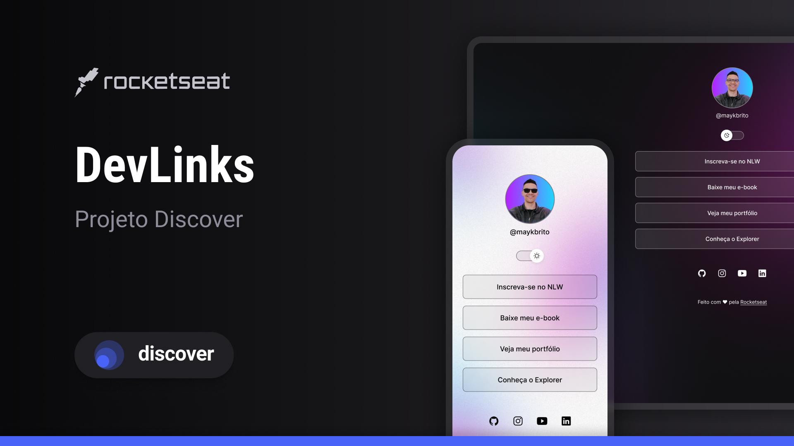

<h1 align="center"> DevLinks</h1>

 Programa exclusivo e garantido, promovido pela rocketseat para ensino de tecnologias WEB 

<a href="#-tecnologias">Tecnologias</a>&nbsp;&nbsp;&nbsp;|&nbsp;&nbsp;&nbsp;
<a href="#-projeto">projeto</a>&nbsp;&nbsp;&nbsp;|&nbsp;&nbsp;&nbsp;
<a href="#-layout">layout</a>&nbsp;&nbsp;&nbsp;|&nbsp;&nbsp;&nbsp;
<a href="#-memo-licensa">Licensa</a>

 

## 🚀Tecnologias 
Esse projeto foi desenvolvido com as seguintes tecnologias 
-HTML E CSS
-JavaScript
- Git e Github
-Figma

## 💻 Projeto
O DevLinks é um agregador de links para usar como cartão de visitas oline.

## 📋 Layout
Você pode visualizar o layout do projeto através [DESSE LINK]
(https://www.figma.com/file/tufY0r5iCKo128mCjlGjex/DevLinks-%E2%80%A2-Projeto-Discover-(Community)?type=design&node-id=10-620&t=Hq3ZnXb7fQJysOf9-0). È necessário ter conta no [FIGMA] (https://figma.com) para acessá-lo.

## :memo: Licença
Esse projeto está sobre a liceça do MIT.

Feito com 🤍 by Rocketseat :wave: [Participe da nossa comunidade!]
(https://discord.gg/rocketseat)